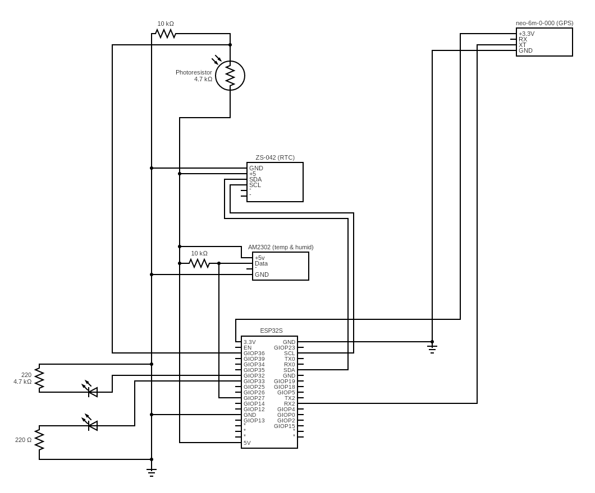

# Vejrstationen
Vejrstationen er et system som kører en ESP32S og er ansvarlig for at tage vejr målinger og sende dem op til SkySensorsAPI’en via Wifi. Vejrstationen tager målinger for temperatur, fugtighed og lysstyrke. Desuden holder den styr på sin tid med hjælp fra et RTC (real time clock) modul og den synkroniserer tiden ved hjælp fra internettet. Derudover er der også installeret et GPS-modul som fortæller API’en hvor vejrstationen er hende.

## Local Development
### Opsætning af projekt
1.	Download og installerer [Arduiono IDE](https://www.arduino.cc/en/software).
2.	Klon dette repository ned lokalt til din computer.
3.	Unzip `/src/libaries.zip` og flyt mapperne ind til Arduino biblioteks mappen, på Windows er den normalt fundet på `C:\Users\(User)\Documents\Arduino\libraries`.
4.	Åben `/src/weather_station/weather_station.ino` igennem Arduiono IDE.
5.	Åben Boards Manager ved at trykke på `Tools->Board->Boards Manager` og derefter søg efter `ESP32`.
6.	Installer `esp32 by Espressif Systems`. 
### Deployment til hardwaren
1.	Åben `weather_station.ino` igennem Arduiono IDE.
2.	Vælg `ESP32 Dev Module` board ved at trykke på `Tools->Board->esp32->ESP32 Dev Module`
3.	Sikre at vejrstationen er forbundet til computeren via USB og vælg den rigtige COM port under `Tools->Port->COMx`.
4.	Upload projektet ved at trykke på `Sketch->Upload`. Upload processen tager ca. 2 minutter og når du ser `Connecting…` i loggen skal du tykke på BOOT knappen på ESP32 modulet.

## Hardware
### Kredsløbsdiagram:

### Prototype på breadboard:

## Klasse diagram
